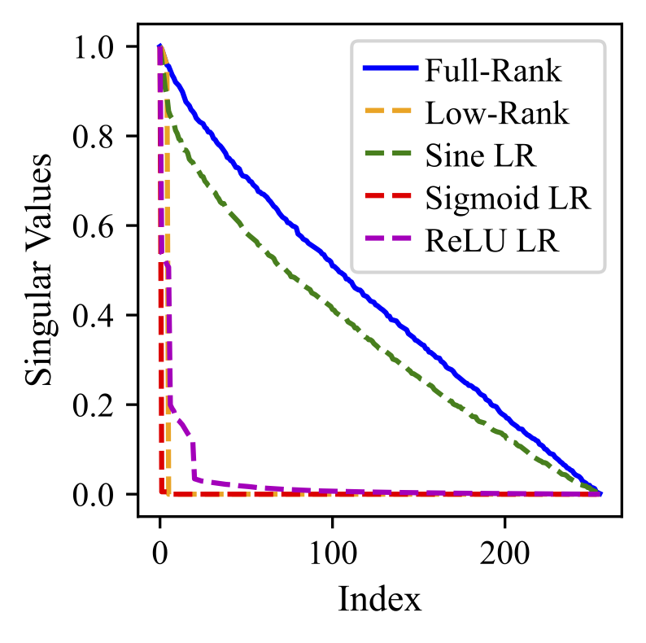
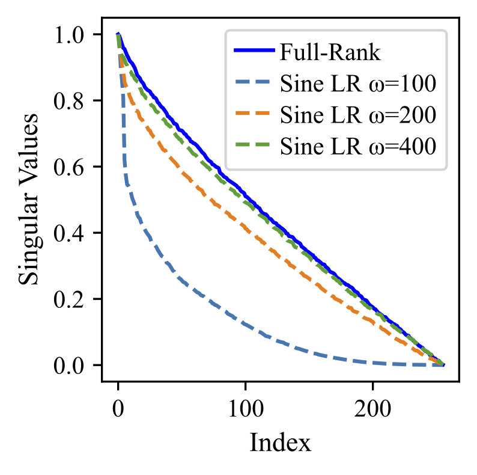

<h1 align="center">
    <p> Efficient Learning with Sine-Activated Low-Rank Matrices </p>
</h1> 

[[`Paper`](https://arxiv.org/abs/2403.19243)] [[`Website`](https://github.com/samy-ji/Sine-Low-Rank/)] 

The official PyTorch implementation of [**Efficient Learning with Sine-Activated Low-Rank Matrices**](https://arxiv.org/abs/2403.19243) 

Sine-LoRA applies a sine function to improve the spectrum of low-rank decompositions for fine-tuning. 

|  |  |
|--------------------------------------------------|--------------------------------------------------|

Applying a sine nonlinearity to a low-rank matrix  $\phi(\mathbf{x}) = \sin(\omega \mathbf{U} \mathbf{V}^{T})$ has improved spectral properties. $\omega$ controls the spectrum smoothness.


```
## LoRA forward pass
  def forward(self, x: torch.Tensor):
    base_result = F.linear(x, transpose(self.weight, self.fan_in_fan_out), bias=self.bias)
    dropout_x = self.lora_dropout(x)

    result += (self.lora_B(self.lora_A(dropout_x.to(self.lora_A.weight.dtype)))) * self.scaling
    return result

## Sine LoRA forward pass
  def forward(self, x: torch.Tensor):
    base_result = F.linear(x, transpose(self.weight, self.fan_in_fan_out), bias=self.bias)
    dropout_x = self.lora_dropout(x)

    result += ((self.lora_dropout(x.to(self.lora_A.weight.dtype))) @ torch.sin(self.freq * self.lora_A.weight.T @ self.lora_B.weight.T))/self.s * self.scaling
    return result 

```


**Performance and parameter count of the LLaMA 3-8B model fine-tuned using the LoRA and sine-LoRA methods** 

| **Method**              | **Params** | **BoolQ** | **PIQA** | **SIQA** | **HS**   | **WG**   | **ARC-e** | **ARC-c** | **OBQA** | **Avg.** |
|--------------------------|------------|-----------|----------|----------|----------|----------|-----------|-----------|----------|----------|
| LoRA<sub>k=4</sub>       | 7.1M       | **73.6**  | 86.3     | **80.0**  | **94.9**  | 80.0     | 63.9      | 78.7      | 83.0     | 80.0     |
| Sine LoRA<sub>k=4</sub>  | 7.1M       | 72.7      | **87.4**  | 79.3     | 94.4     | **85.3**  | **75.0**  | **88.6**  | **86.2** | **83.6** |
| LoRA<sub>k=8</sub>       | 14.2M      | 73.0      | **87.4**  | 78.8     | 72.2     | 85.8     | **77.5**  | **88.4**  | 83.2     | 80.8     |
| Sine LoRA<sub>k=8</sub>  | 14.2M      | **73.4**  | 86.5     | **80.3**  | **94.2**  | **85.9**  | 76.4      | 88.1      | **84.6** | **83.7** |
| LoRA<sub>k=16</sub>      | 28.3M      | 73.6      | 85.6     | 79.3     | 94.0     | **85.7**  | 75.4      | 86.4      | 83.2     | 82.9     |
| Sine LoRA<sub>k=16</sub> | 28.3M      | **73.7**  | **87.7**  | **80.8**  | **94.9**  | 84.5     | **79.1**  | **89.8**  | **84.4** | **84.4** |
| LoRA<sub>k=32</sub>      | 56.6M      | 70.6      | 86.1     | 78.3     | 91.5     | 83.2     | 69.7      | 85.7      | 81.4     | 80.8     |
| Sine LoRA<sub>k=32</sub> | 56.6M      | **72.4**  | **86.5**  | **79.8**  | **94.0**  | **85.2**  | **78.1**  | **87.6**  | **85.0** | **83.6** |


**Performance and parameter count of the LLaMA 3-8B model fine-tuned using the DoRA and sine-DoRA methods**

| **Method**              | **Params** | **BoolQ** | **PIQA** | **SIQA** | **HS**  | **WG**  | **ARC-e** | **ARC-c** | **OBQA** | **Avg.** |
|--------------------------|------------|-----------|----------|----------|---------|---------|-----------|-----------|----------|----------|
| DoRA<sub>k=8</sub>      | 14.9M      | 73.2      | 87.7     | 79.9     | 94.7    | 84.5    | 89.3      | 78.0      | 83.2     | 83.8     | 
| Sine DoRA<sub>k=8</sub> | 14.9M      | **73.9**  | **89.0** | **81.0** | **95.3**| **86.1**| **90.1**  | **79.0**  | **87.0** | **85.2** |        
| DoRA<sub>k=16</sub>    | 29.1M      | 74.5      | 88.8     | 80.3     | **95.5**| 84.7    | **90.1**  | 79.1      | 87.2     | 85.0     | 
| Sine DoRA<sub>k=16</sub>| 29.1M      | **75.1**  | **89.0** | **81.0** | 95.3    | **86.1**| 90.0      | **79.3**  | **86.2** | **85.3** |      
| DoRA<sub>k=32</sub>    | 57.4M      | 74.6      | **89.3** | 79.9     | 95.5    | 85.6    | **90.5**  | **80.4**  | **85.8** | 85.2     | 
| Sine DoRA<sub>k=32</sub>| 57.4M      | **75.8**  | **89.3** | **80.3** | **95.9**| **86.1**| 90.2      | 79.4      | 85.4     | **85.3** |       


[1] Liu et al. DoRA: Weight-Decomposed Low-Rank Adaptation. ICML 2024

## Contact
Yiping Ji [yiping.ji@adelaide.edu.au](yiping.ji@adelaide.edu.au) or Hemanth Saratchandran [hemanth.saratchandran@adelaide.edu.au](hemanth.saratchandran@adelaide.edu.au).

## Citation
If you find Sine-LoRA useful, please consider giving a star and citation:

```bibtex
@article{ji2024sine,
  title={Efficient Learning with Sine-Activated Low-Rank Matrices},
  author={Ji, Yiping and Saratchandran, Hemanth and Gordon, Cameron and Zhang, Zeyu and Lucey, Simon},
  journal={arXiv preprint arXiv:2403.19243},
  year={2024}
}
```
